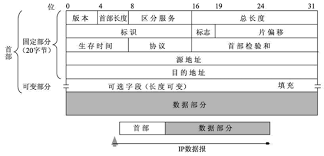

### IP数据报结构

1. 版本：区分IP协议版本
2. 首部长度：因为有可选字段，所以需要表明首部长度
3. 服务类型
4. 数据报长度：首部加上数据，字节为单位，长16位，理论上IP数据报的最大长度位65535字节，但是由于以太网帧的限制，一般不超过1500
5. 标识、标志、片偏移：分片相关
6. 寿命（TTL）：每当一台路由器处理该数据报时，将其减一
7. 协议：标明运输层协议
8. 首部检验和：路由器检测首部
9. 源和目的IP地址
10. 选项：v6已经去掉
11. 数据

### IPv4数据分片
链路层的最高负载不同，导致了IP数据报的数据大小可能超过了最高负载，因此要进行分片，
分片的合并在端系统（运输层合并）

### IPv6
fdf

testtest