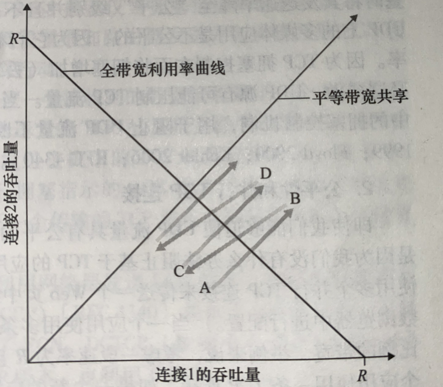

### 如何保证可靠传输
TCP主要提供了检验和、序列号/确认应答、超时重传、最大消息长度、滑动窗口控制等方法实现了可靠性传输。

#### 比特差错（ARQ）：

为了防止比特差错首先引入差错检验

其次接收方反馈（ACK和NAK）,如果成功接收反馈ACK，否则NAK

重传，如果收到NAK，重传，为了防止ACK和NAK出错，引入冗余分组，当ACK和NAK出错时，也会重传

序列号，由于冗余分组，接收方无法确认冗余分组是重复的还是新的，所以加入序列号

#### 丢包

超时重传、序列号在此也起作用

### 最大报文长度
* TCP 可从缓存中取出并放入报文段的数据数量受限于**最大报文长度**（MSS）
* MMS受限于最大链路层帧长度（最大传输单元MTU），MTU一般为1500字节（以太网和PPP链路层协议），TCP/IP首部为40字节，MSS为1460字节
### TCP报文段结构

* 首部长度（偏移）4比特：因为有可变部分，在此指定首部长度
* flags 6比特：（CWR ECE） URG ACK PSH RST SYN FIN 
* 可变部分：发送方与接收方协商最大报文长度，或在高速网络环境下用作窗口调节因子时使用。
* 紧急指针：尾指针，使用时，TCP必须同通知接收端的上层实体（与URG同用），而PSH位置位时，所有数据都提交上层。（一般不使用这三个字段）

### 序号与确认号
* 报文段的序号是最后一个字节的序号，累计确认（确认最后一个字节的序号）
* 初始序号随机选择，可以减少新连接将那些仍在网络中存在的就连接的报文段误认为有效报告文段的有效性
* 乱序报文段的处理为规定，由用户决定
* 确认号和数据报文段可以在一起发送，称为捎带
### 超时
每次重传后，超时时间翻倍
成功收到ACK的情况，记录一个SampleRTT
跟据多次SampleRTT，计算EstimatedRTT = (1-α) * EstimatedRTT + α * SampleRTT
α = 0.125
还会记录DevRTT = (1 - β) * DevETT + β * | SampleRTT - EstimatedRTT|
β = 0.25
TimeoutInterval = EstimatedRTT + 4 * DevRTT
### 快速重传
接收方收到乱序报文段将回复一个冗余确认
发送方收到三个冗余确认，将直接重传
### 流量控制
明确两个概念
* 流量控制是为了消除发送方使接收方缓存溢出的可能性
* 拥塞控制是为了适应IP网络的拥塞

接收窗口用rwnd表示，
rwnd = RcvBuffer - [LastByteRcvd - LastByteRead]
LastByteSent - LastByteAcked <= rwnd

**当接收方的窗口为0时，而且接收方没有要发送给发送方的报文段，发送方就会一直以为窗口为0，那么发送方将不再发送数据，这个问题如何解决？**
发送方收到窗口为0的报文段时，发送一个只有一个字节数据的报文段，这些报文段将被接收方接收确认，当接收方缓存清空后，在确认报文包含一个非0的rwnd值

### 连接管理
**握手**

**注意几点：**
* 为了某些安全原因，序号应该随机开始
* 最后一次ACK报文已经可以携带数据(处于ESTABLISHED状态)

**socket接口与握手的关系**

**挥手**

**泛洪攻击**
攻击者只发送SYN报文，不发送第三个ACK报文，导致半连接队列溢出
如何解决呢？
采用SYN cookie方式，半连接不分配资源，将端口号和ip用私钥加密，通过synack回复给客户端，如果客户端回复的cookie验证正确（此报文的ip地址和端口加密后与cookie一致），那么为其分配资源。

### 错误情况
1. 客户端要连接的端口不接受连接，对方会返回一个RST标志报文段，如果时UDP，则返回一个特殊的ICMP数据报

### 拥塞控制
路由器缓存溢出

**一般有两种方法：**
* 端到端：网络层没有为运输层拥塞控制提供 *显示支持* 。TCP采用这种。
* 网络辅助的拥塞控制，路由器向发送方提供关于网络中拥塞状态的显示反馈信息。
    * 直接网络反馈
    * 标记发送方的报文的某个字段，接收方收到后，会通知发送方

### TCP的拥塞控制
TCP必须采用端到端拥塞控制，因为IP层不提供显示的网络拥塞反馈
1. 如何限制速率？
   拥塞窗口：cwnd，速率为cwnd/RTT，调节cwnd即可调节速率
2. 如何感知拥塞？
   丢包事件
3. 感知拥塞后如何采用何种算法来改变其发送速率？
   TCP拥塞控制算法：AIMD (Additive-Increase, Multiplicative-Decrease)
   1. 慢启动
    初始时cwnd以一个MSS开始，每收到本轮MSS数量的ACK，cwnd就翻一倍
    何时结束慢启动：
      1. 遇到拥塞，ssthresh设置为cwnd/2，cwnd设为1。
      2. 当cwnd到ssthresh的时候，开始拥塞避免模式。
      3. 检测到3个冗余ACK，TCP执行快速重传并进入快速恢复模式。（option）     
   2. 拥塞避免
      1. 每个RTT只增加一个MSS。
      2. 遇到超时或3个冗余ACK，机制和慢启动一致。
   3. 快速恢复 （option）
      1. ssthresh设置为cwnd的一半，cwnd减半，因为收到了3个冗余ACK，再加上3。
      2. 对收到的每个冗余ACK，增加一个MSS。
      3. 当丢失报文段的一个ACK到达时，TCP在降低cwnd后进入拥塞避免。
      4. 超时后进入慢启动。
### 公平性
对于TCP，当RTT相等时是公平的，RTT越小，占用带宽更大

